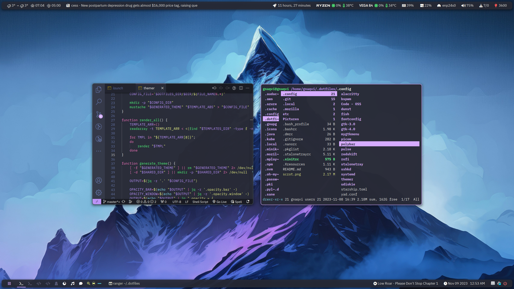

# dotfiles

Clone to `$HOME/.dotfiles` and use the helper `dfy` script to dotify or restore files.

- Run `.local/bin/dfy -d <path-from-home>` to dotify existing config files to `$HOME/.dotfiles` directory
- Run `.local/bin/dfy -r <path-from-home>` to restore config files from `$HOME/.dotfiles` directory to $HOME

Environment can be themed using the `themer` script which utilizes `mustache` templates.

- Themer templates reside in `~/.dotfiles/.config/themer/templates`.
- Templates depend on themer configuration file found at `$HOME/.config/themer/config.json` which can be modified accordingly.
- Color themes are placed in `$HOME/.config/themer/colors` and can be referenced in themer configuration file.
- Run `.local/bin/themer --generate-theme` to generate theme.
- Run `.local/bin/themer --write-all` to render all templates.
- Run `.local/bin/themer --wallpaper` to update wallpaper as per generated theme.

